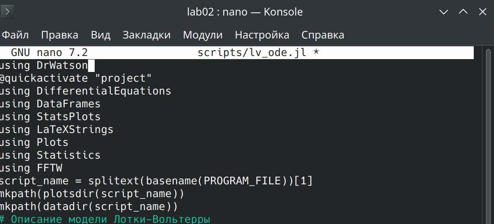
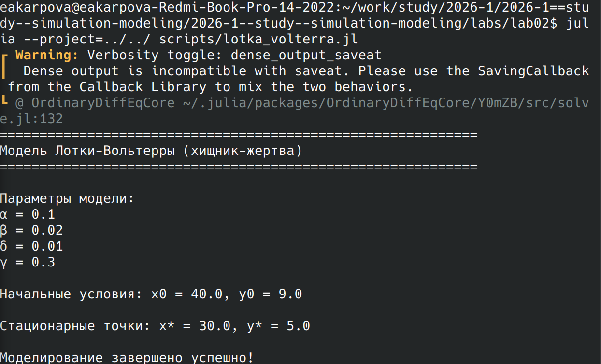
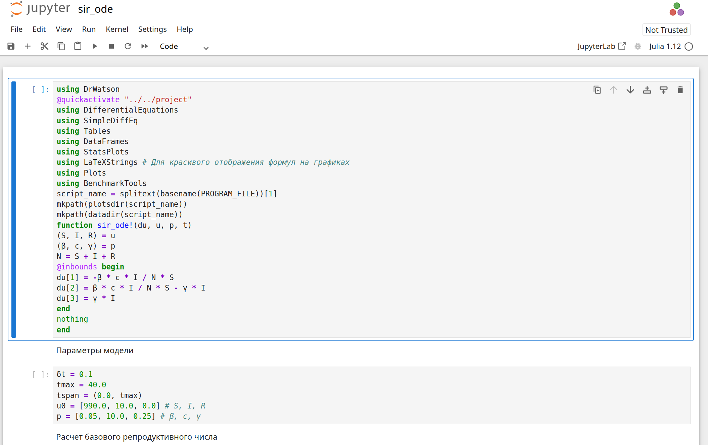
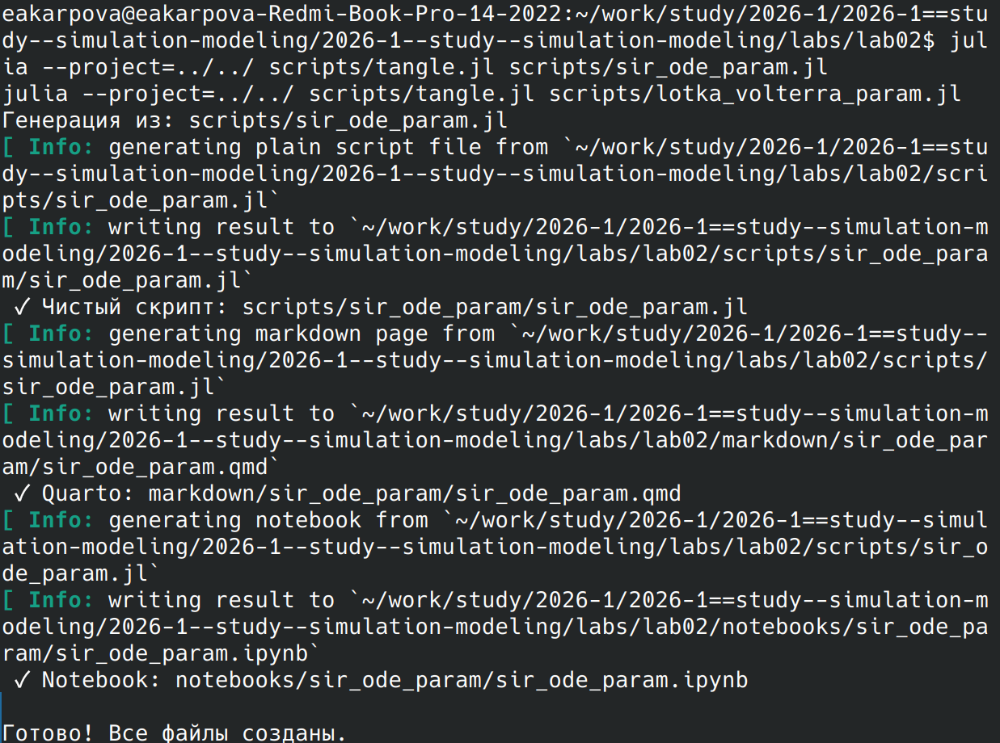

---
## Author
author:
  name: Карпова Есения Алексеевна
  degrees: DSc
  orcid: 0000-0002-0877-7063
  email: kulyabov-ds@rudn.ru
  affiliation:
    - name: Российский университет дружбы народов
      country: Российская Федерация
      postal-code: 117198
      city: Москва
      address: ул. Орджоникидзе 3
## Title
title: Лабораторная работа №2
subtitle: Имитационное моделирование. Основные модели
license: CC BY
date: today
date-format: "YYYY-MM-DD" # Example: 2025-09-06
---

# Вводная часть

## Цель работы

Исследовать математические модели SIR (эпидемиологическая) и Лотки–Вольтерры (хищник-жертва)

## Задачи

- Изучить математическую модель SIR
- Изучить модель Лотки-Вольтерры
- Сгенерировать производные форматы

## Установка пакетов

## Скрипт

 Запуск модели SIR

## Запуск модели Лотки-Вольтерры

## Генерация производных форматов

## Запуск в jupyter

## Параметрическая версия скрипта

## Запуск параметрических версий скрипта

## Создание производных форматов с параметрами

## Запуск кода с параметрами в jupyter

# Результаты
