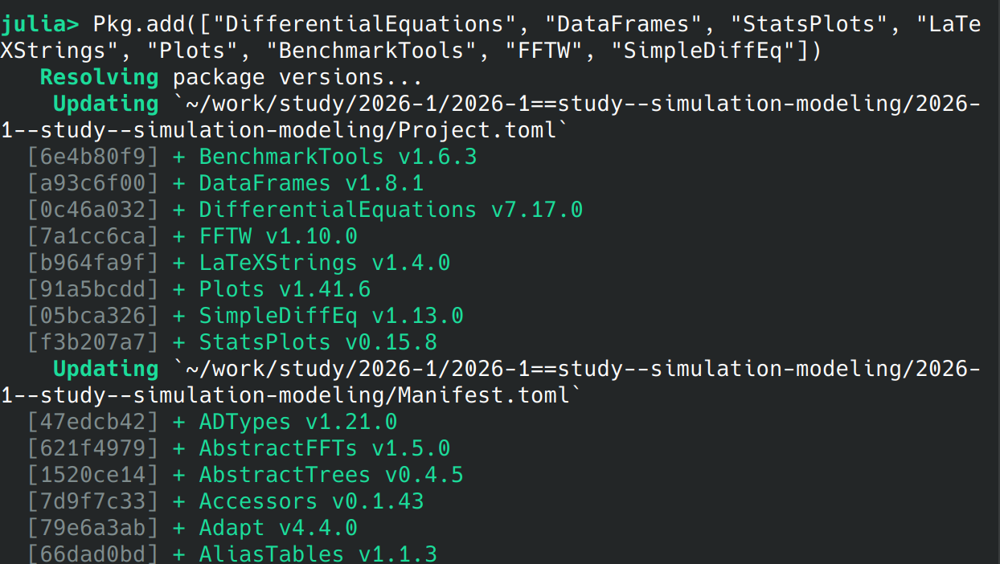
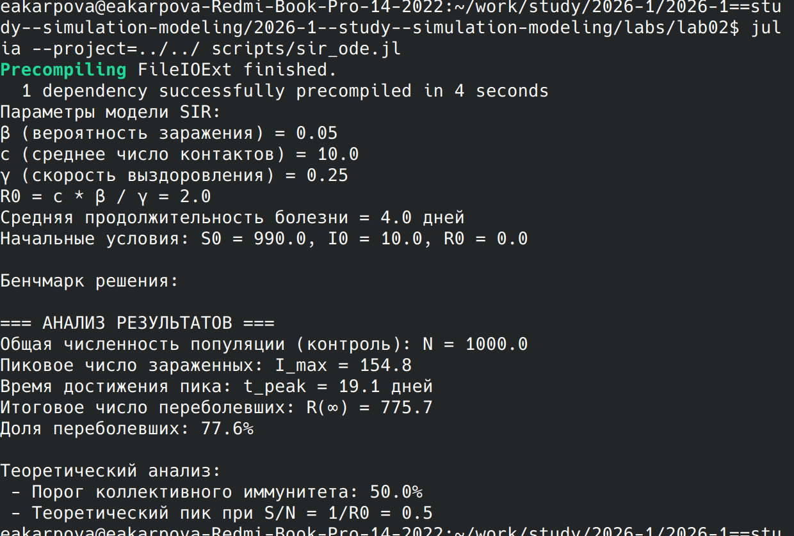
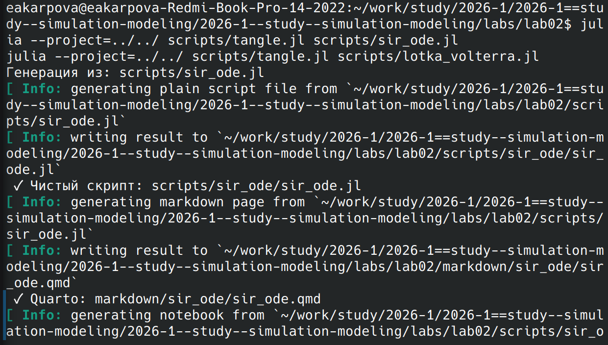
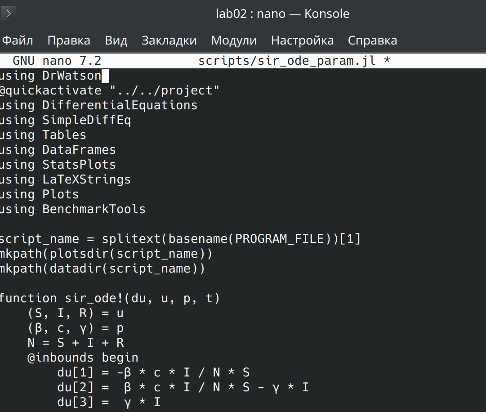
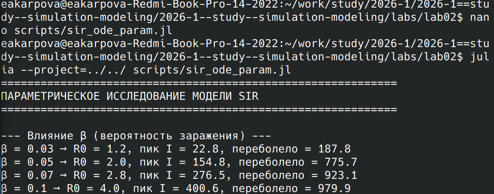
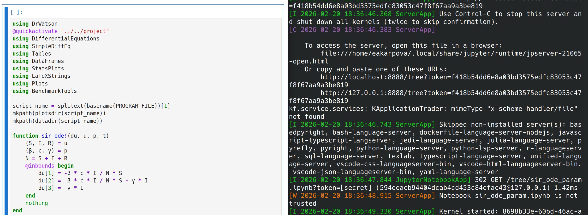

---
## Author
author:
  name: Карпова Есения Алексеевна
  degrees: DSc
  orcid: 0000-0002-0877-7063
  email: 1132236008@rudn.ru
  affiliation:
    - name: Российский университет дружбы народов
      country: Российская Федерация
      postal-code: 117198
      city: Москва
      address: ул. Орджоникидзе, 3

## Title
title: "Имитационное моделирование"
subtitle: "Лабораторная работа №2"
license: "CC BY"
---

# Цель работы

 Исследовать математические модели SIR (эпидемиологическая) и Лотки–Вольтерры (хищник-жертва) путем численного решения соответствующих систем дифференциальных уравнений, провести параметрический анализ и визуализацию полученных результатов с использованием языка Julia и инструментов воспроизводимых исследований.

# Задание

1. Изучить математическую модель SIR

2. Изучить модель Лотки-Вольтерры

3. Сгенерировать производные форматы

4. Провести параметрическое исследование моделей

# Теоретическое введение

Модель SIR описывает динамику распространения инфекционного заболевания в закрытой популяции. Популяция делится на три группы: восприимчивые (S), заразные (I) и выздоровевшие (R). Ключевыми допущениями модели являются: постоянство общей численности, однородное смешение индивидов, отсутствие латентного периода и пожизненный иммунитет после выздоровления. Основной параметр модели — базовое репродуктивное число R0=β/γR0​=β/γ (или R0=(cβ)/γR0​=(cβ)/γ в трёхпараметрической версии), которое определяет, будет ли эпидемия расти (R0>1R0​>1) или затухать (R0<1R0​<1). Эффективное репродуктивное число Re=R0(S/N)Re​=R0​(S/N) учитывает уменьшение доли восприимчивых со временем и падает ниже 1 в момент достижения пика эпидемии.

Модель Лотки–Вольтерры описывает колебания численности двух взаимодействующих видов: жертв и хищников. Система уравнений основана на принципе «закон массового действия»: скорость изменения численности жертв определяется их естественным приростом (αxαx) и убылью от поедания хищниками (βxyβxy), а численность хищников растёт пропорционально потреблённым жертвам (δxyδxy) и убывает за счёт естественной смертности (γyγy). Модель демонстрирует циклические колебания популяций со сдвигом фаз (пик хищников отстаёт от пика жертв) и имеет нетривиальную стационарную точку x∗=γ/δx∗=γ/δ, y∗=α/βy∗=α/β, вокруг которой траектории на фазовой плоскости образуют замкнутые кривые.

Обе модели являются фундаментальными в своих областях. SIR широко используется в эпидемиологии для оценки масштаба угрозы, прогнозирования пиковой нагрузки на здравоохранение и анализа эффективности карантинных мер. Модель Лотки–Вольтерры, несмотря на свою идеализированность, служит основой для понимания механизмов колебаний в экосистемах и демонстрирует, как даже простые нелинейные взаимодействия могут порождать сложную динамику. Ограничения обеих моделей (однородность популяции, постоянство параметров, отсутствие временных задержек) стимулировали развитие более реалистичных модификаций: SIRS, SEIR для эпидемиологических задач и моделей с внутривидовой конкуренцией и ёмкостью среды для экологических систем.

# Выполнение лабораторной работы

## Модель SIR

В среде Julia были установлены пакеты для численного решения дифференциальных уравнений, работы с табличными данными, визуализации и спектрального анализа. Дополнительно установлен пакет Literate для последующей генерации производных форматов отчетов.

Был дан скрипт, реализующий трёхпараметрическую модель SIR с разделением заразности на вероятность передачи инфекции и частоту контактов. В скрипте заданы начальные условия, параметры модели и функция, описывающая систему дифференциальных уравнений.

При выполнении скрипта проведено численное решение системы уравнений, рассчитано базовое репродуктивное число и получены массивы данных по динамике всех трёх групп населения. Результаты включали пиковое значение заражённых, время достижения пика и итоговую долю переболевших.

## Модель Лотки-Вольтерры

Аналогично был запушен скрипт для модели хищник-жертва, описывающей циклические колебания численности двух взаимодействующих видов. В скрипте заданы классические параметры модели и начальные условия, а также функция, реализующая систему уравнений Лотки–Вольтерры.

## Генерация производных форматов

Был создан вспомогательный скрипт tangle.jl, использующий пакет Literate для автоматической генерации чистого кода, Quarto-документов и Jupyter-ноутбуков из исходных скриптов с документацией. С помощью скрипта tangle из исходных файлов sir_ode.jl и lotka_volterra.jl были созданы чистые версии кода без комментариев, документы в формате Quarto с полным описанием моделей и Jupyter-ноутбуки для интерактивной работы. Все сгенерированные файлы размещены в соответствующих папках проекта.

С использованием установленного через Conda Jupyter были открыты и выполнены ноутбуки для обеих моделей. В каждом ноутбуке последовательно запущены все ячейки с кодом, что позволило убедиться в корректности работы моделей в интерактивном режиме и воспроизводимости результатов.

## Создание параметрических версий моделей

На основе базовых скриптов разработаны параметрические версии, включающие циклы по различным значениям ключевых параметров. Для модели SIR исследовалось влияние коэффициента заразности и скорости выздоровления, для модели Лотки–Вольтерры — влияние скорости роста жертв и смертности хищников.

Параметрические версии были выполнены, в процессе чего автоматически строились графики зависимостей пиковых значений и средних популяций от варьируемых параметров. Результаты включали тепловые карты и сравнительные фазовые портреты, сохранённые в папку с графиками.

С помощью скрипта tangle из параметрических скриптов были созданы чистые версии кода, Quarto-документы и Jupyter-ноутбуки. Это обеспечило единообразие представления результатов для всех вариантов моделей.

Сгенерированные Jupyter-ноутбуки для параметрических версий были открыты и выполнены. Интерактивный режим позволил дополнительно исследовать поведение моделей и убедиться в корректности параметрического анализа.

# Выводы

В ходе работы реализованы численные модели SIR и Лотки–Вольтерры на языке Julia. Исследована динамика эпидемического процесса и колебаний в системе хищник-жертва. Проведен параметрический анализ влияния ключевых коэффициентов на поведение систем. Полученные результаты визуализированы, освоены принципы воспроизводимых исследований с использованием DrWatson и Literate.

