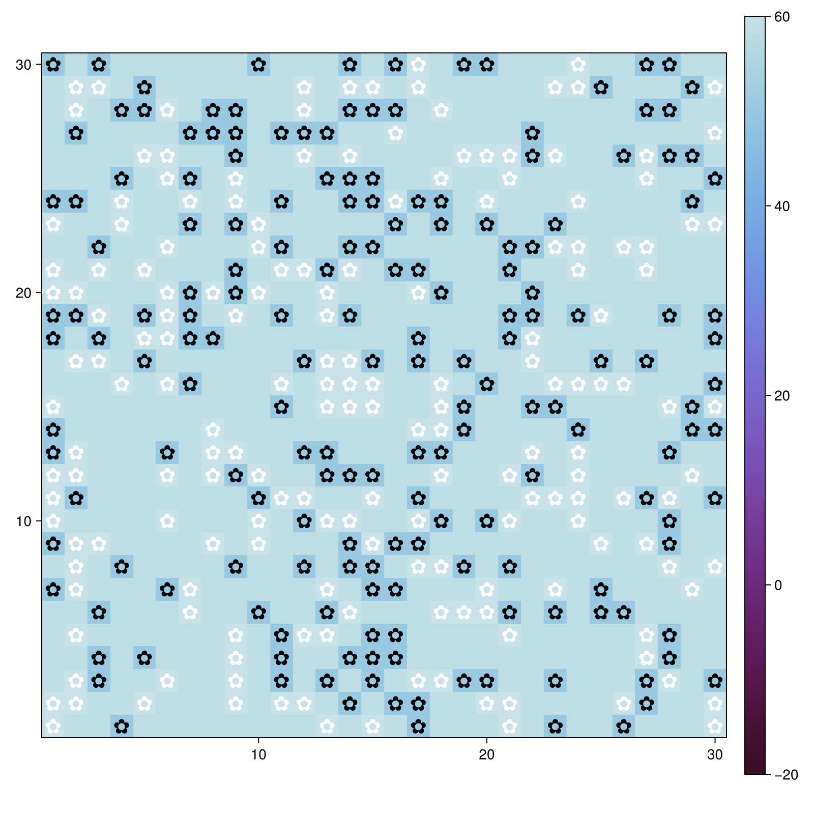
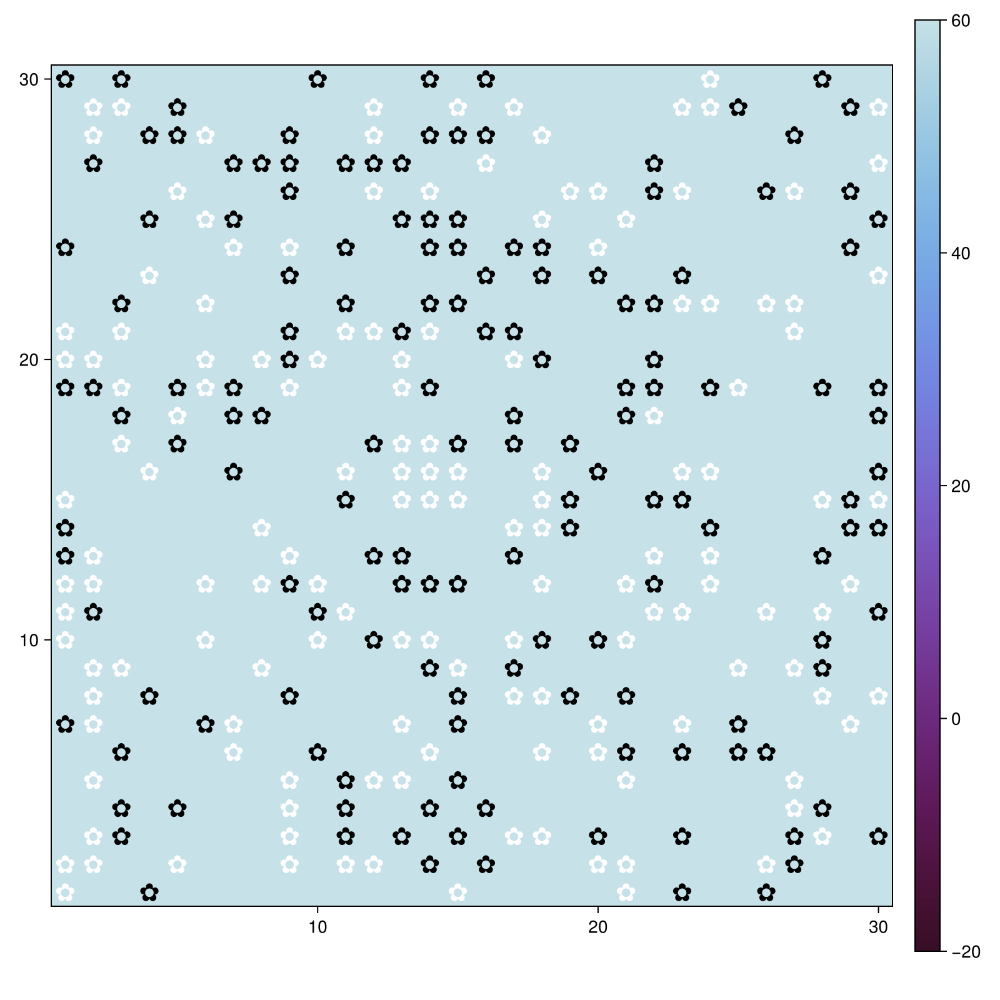
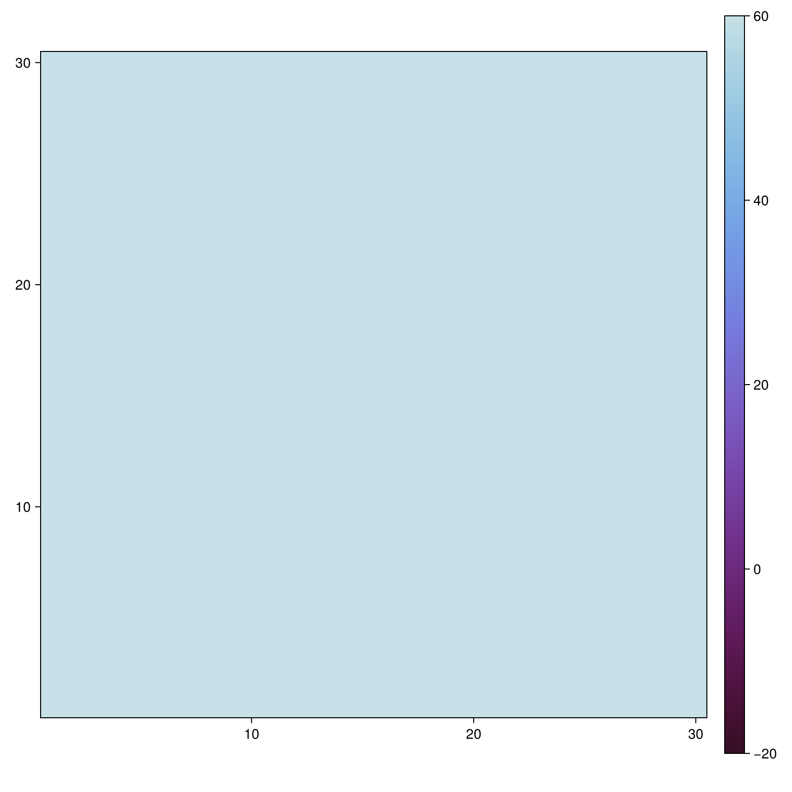
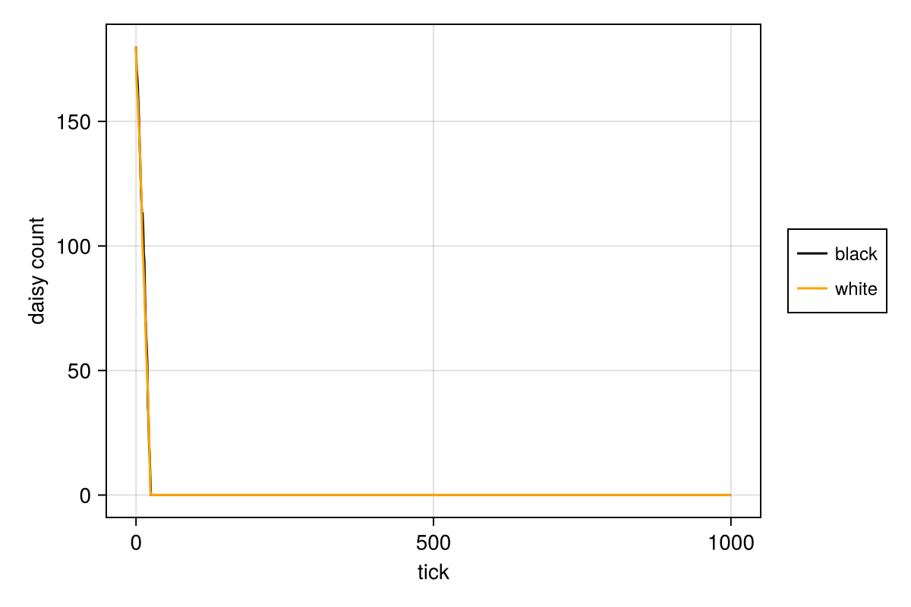
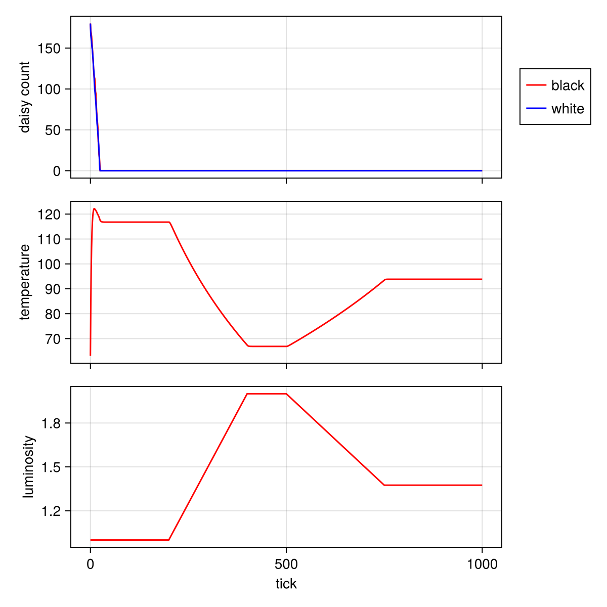

---
## Author
author:
  name: Карпова Есения Алексеевна
  degrees: DSc
  orcid: 0000-0002-0877-7063
  email: kulyabov-ds@rudn.ru
  affiliation:
    - name: Российский университет дружбы народов
      country: Российская Федерация
      postal-code: 117198
      city: Москва
      address: ул. Миклухо-Маклая, д. 6
## Title
title: Модель Daisyworld
subtitle: Лабораторная работа №3
license: CC BY
date: today
date-format: "YYYY-MM-DD" # Example: 2025-09-06
---

# Введение

## Цель и задачи

Цель: исследовать саморегуляцию климата в модели Daisyworld

Реализовать модель

Визуализировать эволюцию

Создать анимацию

Проанализировать численность

Исследовать изменение светимости

Провести параметрический анализ

# Модель

## Суть модели

Чёрные маргаритки → поглощают тепло (альбедо 0.25)

Белые маргаритки → отражают тепло (альбедо 0.75)

Размножение при оптимальной температуре

Саморегуляция температуры

## Параметры

| Параметр | Значение |
|----------|----------|
| max_age | 25 |
| albedo_black | 0.25 |
| albedo_white | 0.75 |
| surface_albedo | 0.4 |
| solar_luminosity | 1.0 |

## Базовая визуализация

{width=40%}

*Начальное состояние*

## Эволюция

{width=10%}

*Через 5 шагов*

{width=10%}

*Через 40 шагов*

## Анимация

Формирование пространственных паттернов

Адаптация к температуре

Саморегуляция

## Динамика численности

{width=40%}

Колебания в противофазе

Равновесие популяций

## Изменение светимости

{width=40%}
[simulation.mp4](../project/plots/simulation.mp4){width=40%}

Рост светимости → больше белых маргариток

# Вывод

Система саморегулируется

Компенсирует изменение светимости

Устойчива к изменению параметров

Иллюстрация гипотезы Геи
