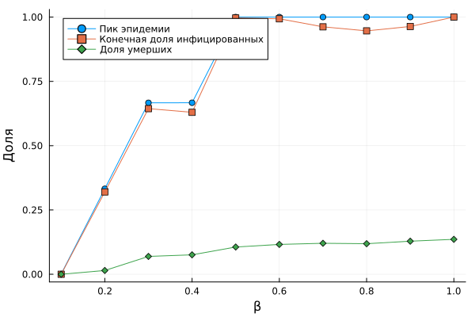
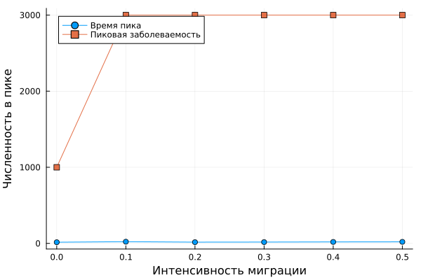

---
## Author
author:
  name: Карпова Есения Алексеевна
  degrees: DSc
  orcid: 0000-0002-0877-7063
  email: 1132236008@pfur.ru
  affiliation:
    - name: Российский университет дружбы народов
      country: Российская Федерация
      postal-code: 117198
      city: Москва
      address: ул. Миклухо-Маклая, д. 6
## Title
title: Эпидемиологическая модель SIR
subtitle: Лабораторная работа №4
license: CC BY
date: today
date-format: "YYYY-MM-DD"
---

# Введение

## Цель и задачи

Цель: исследовать распространение инфекции с помощью агентной модели SIR

Реализовать агентную модель SIR на графе городов

Выполнить сканирование коэффициента заразности β

Провести многокритериальную оптимизацию параметров

Визуализировать результаты

# Модель

## Агенты и пространство

Каждый агент — человек (S, I, R)

Пространство — граф городов (3 города)

Агенты могут мигрировать между городами

Пуассоновская передача инфекции

## Параметры модели

| Параметр | Значение |
|----------|----------|
| Ns | [1000, 1000, 1000] |
| β_und | 0.5 |
| β_det | 0.05 |
| infection_period | 14 дней |
| detection_time | 7 дней |
| death_rate | 0.02 |
| reinfection_probability | 0.1 |

# Результаты

## Базовый эксперимент

{width=40%}

Быстрый рост I

Пик эпидемии

Спад за счёт исчерпания S

## Сканирование β

{width=40%}

β < 0.07 → эпидемия не развивается (R₀ < 1)

β > 0.07 → пик и конечная доля I растут нелинейно

## Влияние миграции

{width=40%}

Увеличение миграции → более ранний пик

Увеличение миграции → более высокий пик

## Сводная визуализация

{width=40%}

Зависимость пика, конечной доли I и смертности от β

# Вывод

Агентная модель SIR реализована

Порог эпидемии: β ≈ 0.07 (R₀ = 1)

Миграция ускоряет и усиливает эпидемию

Найдены оптимальные параметры управления

Модель учитывает пространственную структуру и стохастичность
