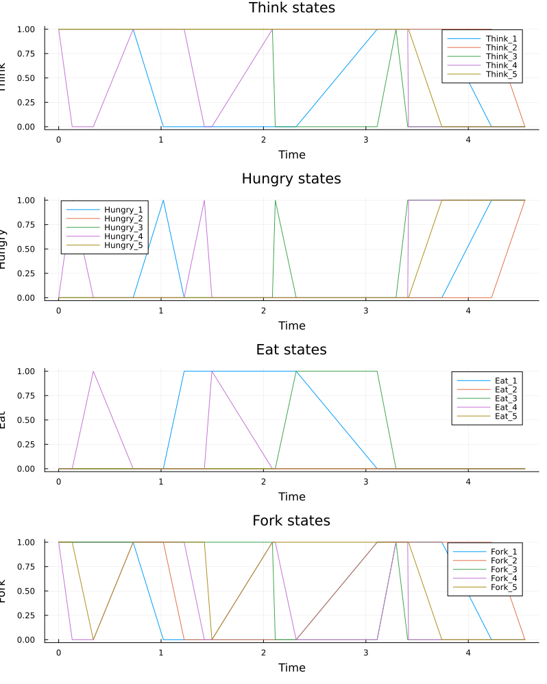
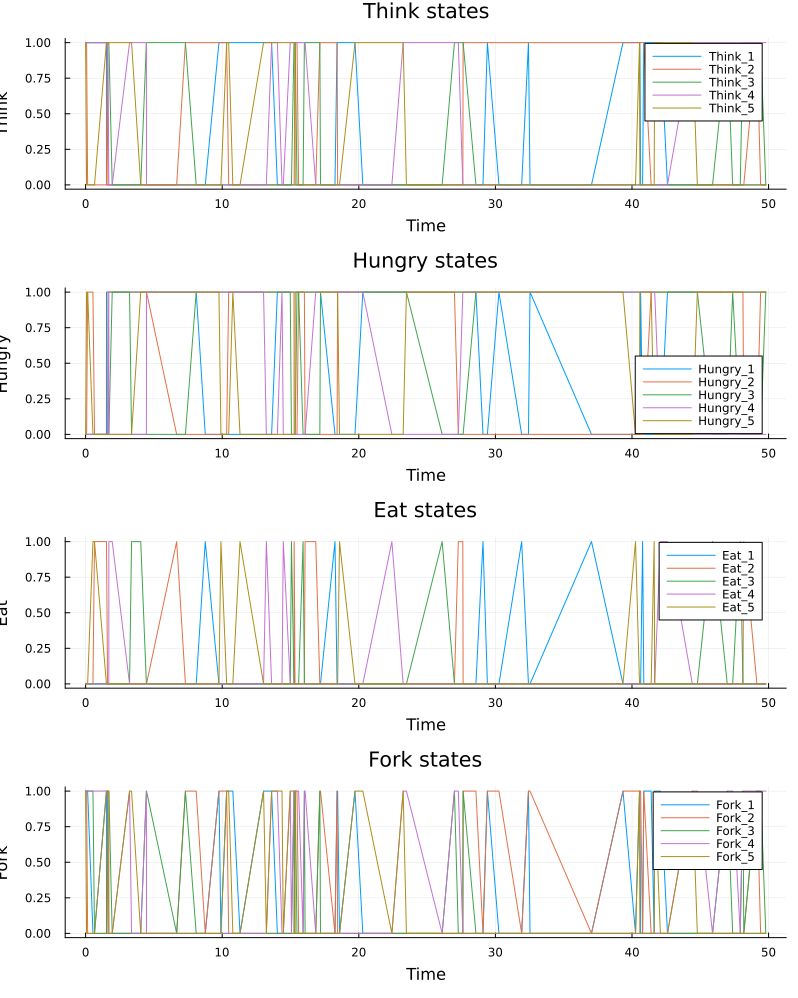
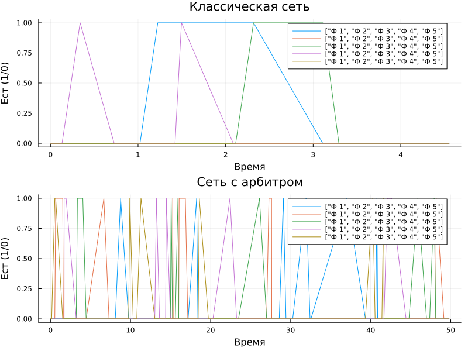

---
## Author
author:
  name: Карпова Есения Алексеевна
  degrees: DSc
  orcid: 0000-0002-0877-7063
  email: kulyabov-ds@rudn.ru
  affiliation:
    - name: Российский университет дружбы народов
      country: Российская Федерация
      postal-code: 117198
      city: Москва
      address: ул. Миклухо-Маклая, д. 6

## Title
title: "Лабораторная работа №5"
subtitle: "Обедающие философы"
license: "CC BY"
---

# Цель работы

Исследовать проблему синхронизации «Обедающие философы» с помощью сетей Петри, обнаружить взаимную блокировку (deadlock) в классической модели и продемонстрировать её устранение с помощью арбитра.

# Задачи

1. Построить сеть Петри для классической задачи обедающих философов.

2. Провести стохастическое моделирование и обнаружить deadlock.

3. Построить модифицированную сеть с арбитром, предотвращающую deadlock.

4. Сравнить поведение двух моделей.

5. Визуализировать эволюцию маркировки и анимацию процесса.

# Теоретическое введение

## Задача обедающих философов

Задача была сформулирована Эдгером Дейкстрой в 1965 году. За круглым столом сидят 5 философов. Перед каждым — тарелка с едой. Между соседями лежит одна вилка. Чтобы поесть, философу нужны две вилки — левая и правая. Философ может думать, быть голодным или есть.

В классической постановке при наивной реализации возникает взаимная блокировка (deadlock): если каждый философ возьмёт левую вилку, все будут ждать правую, и система замирает.

## Сети Петри

Сеть Петри — это двудольный ориентированный граф, состоящий из позиций (кружки), переходов (прямоугольники) и дуг. Позиции содержат фишки (маркеры), которые перемещаются при срабатывании переходов. Сети Петри позволяют моделировать параллельные и асинхронные системы, а также анализировать такие свойства, как ограниченность, живость и достижимость.

# Выполнение лабораторной работы

## Классическая модель (без арбитра)

Для пяти философов была построена сеть Петри, моделирующая классическую постановку задачи. Каждый философ представлен тремя позициями:

- `Think_i` — философ думает;
- `Hungry_i` — философ голоден и хочет есть;
- `Eat_i` — философ ест.

Каждая вилка — отдельная позиция `Fork_i`. Переходы соответствуют действиям:

- `GetLeft_i` — взять левую вилку;
- `GetRight_i` — взять правую вилку;
- `PutForks_i` — положить обе вилки.

**Правила срабатывания переходов:**

- `GetLeft_i` может сработать, если философ думает (`Think_i` = 1) и левая вилка свободна (`Fork_i` = 1). После срабатывания философ переходит в состояние `Hungry_i`, левая вилка становится занятой.
- `GetRight_i` может сработать, если философ голоден (`Hungry_i` = 1) и правая вилка свободна (`Fork_{i+1}` = 1). После срабатывания философ переходит в состояние `Eat_i`, правая вилка становится занятой.
- `PutForks_i` может сработать, если философ ест (`Eat_i` = 1). После срабатывания философ возвращается в состояние `Think_i`, обе вилки освобождаются.

**Результат моделирования классической сети:**

В ходе стохастического моделирования (алгоритм Гиллеспи) было обнаружено, что через некоторое время все философы оказываются в состоянии `Hungry_i`, каждый держит левую вилку и ждёт правую. Ни один переход не может сработать — система заходит в **deadlock** (взаимную блокировку).

## Модель с арбитром

Для предотвращения deadlock была добавлена дополнительная позиция `Arbiter` (арбитр). Арбитр содержит `N-1` фишку (для 5 философов — 4 фишки). Переход `GetLeft_i` теперь требует не только левой вилки и состояния `Think_i`, но и одной фишки от арбитра. Переход `PutForks_i` возвращает фишку арбитру.

**Смысл ограничения:** одновременно есть могут не более `N-1` философов. Это предотвращает ситуацию, когда каждый философ взял по одной вилке и ждёт вторую.

**Результат моделирования сети с арбитром:**

Модель с арбитром никогда не заходит в deadlock. Философы постоянно чередуют состояния, всегда есть хотя бы один eat-философ. Алгоритм Гиллеспи демонстрирует непрерывную работу без замираний.

## Анимация процесса

Для наглядности была создана анимация для трёх философов. На каждом кадре отображается текущее количество фишек в каждой позиции сети. Анимация позволяет наблюдать за перемещением фишек и моментом возникновения deadlock в классической модели.

## Сравнение числа едящих философов

Для количественного сравнения двух моделей были построены графики изменения числа философов в состоянии `Eat` во времени:

- **Классическая сеть:** через некоторое время все `Eat_i` становятся равными нулю — наступает deadlock.
- **Сеть с арбитром:** `Eat_i` постоянно изменяются, всегда есть хотя бы один eat-философ (или они циклически сменяют друг друга). Длительных нулевых периодов нет.

# Выводы

1. Классическая модель приводит к deadlock.

2. Введение арбитра с N-1 фишками предотвращает deadlock.

3. Сети Петри — удобный инструмент для анализа параллельных систем.

4. Анимация и графики наглядно демонстрируют разницу между моделями.

