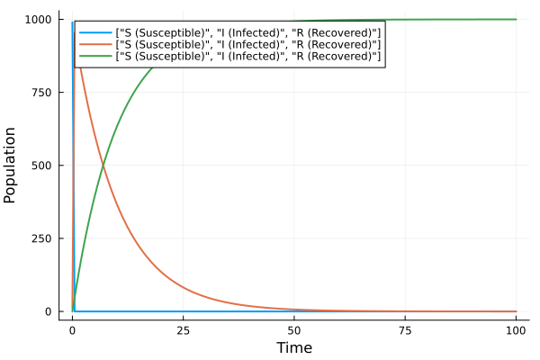
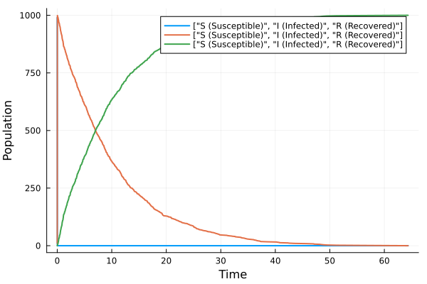
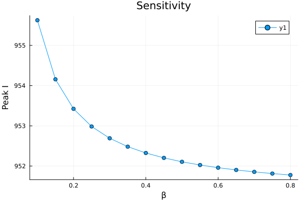

---
## Author
author:
  name: Карпова Есения Алексеевна
  degrees: BSc
  orcid: 0000-0002-0877-7063
  email: 1132236008@rudn.ru
  affiliation:
    - name: Российский университет дружбы народов
      country: Российская Федерация
      postal-code: 117198
      city: Москва
      address: ул. Миклухо-Маклая, д. 6
## Title
title: Лабораторная работа №6
subtitle: Модель SIR в сетях Петри
license: CC BY
date: today
date-format: "YYYY-MM-DD" # Example: 2025-09-06

---
# Цель и задачи работы

Реализовать эпидемиологическую модель SIR с помощью сетей Петри, выполнить детерминированное и стохастическое моделирование, исследовать влияние коэффициента заражения β.

# Выполнение лабораторной работы

## Модель SIR

**S** – здоровые, могут заразиться

**I** – больные, заражают других

**R** – выздоровевшие, имеют иммунитет

## Переходы в сети Петри

Заражение: S + I → I + I

Выздоровление: I → R

## Детерминированная динамика

{width=60%}

## Стохастическая динамика

{width=60%}

## Зависимость пика I и финального R от β

{width=50%}

При малых β эпидемия не развивается

С ростом β пик I и конечное R растут

## Детерминированный vs стохастический

{width=50%}

Оба подхода дают близкие результаты

Стохастический добавляет флуктуации

## Пик I в зависимости от β

{width=50%}

Пороговое явление: при β < 0.1 эпидемии нет

При β > 0.5 пик выходит на насыщение

# Выводы

Модель SIR реализована с помощью сетей Петри

Детерминированный и стохастический подходы дают близкие результаты

С ростом β пик эпидемии и число выздоровевших увеличиваются

Существует порог β, ниже которого эпидемия не возникает

Сети Петри удобны для моделирования эпидемий
