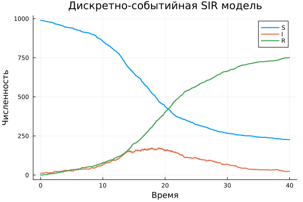
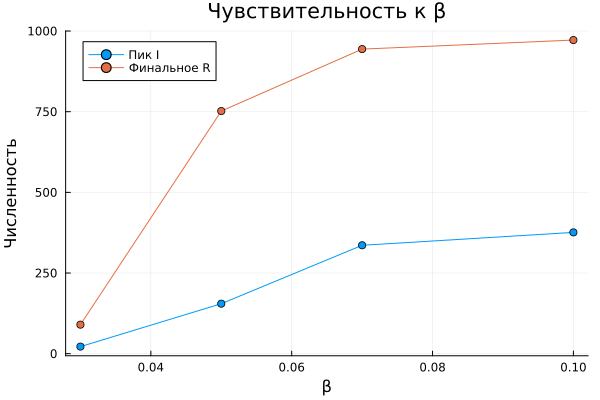

---
## Author
author:
  name: Карпова Есения Алексеевна
  degrees: BSc
  orcid: 0000-0002-0877-7063
  email: 1132236008@rudn.ru
  affiliation:
    - name: Российский университет дружбы народов
      country: Российская Федерация
      postal-code: 117198
      city: Москва
      address: ул. Миклухо-Маклая, д. 6
## Title
title: Лабораторная работа №8
subtitle: Дискретно-событийная модель SIR
license: CC BY
date: today
date-format: "YYYY-MM-DD" # Example: 2025-09-06

---
# Цель и задачи работы

Реализовать дискретно-событийную модель SIR с помощью библиотеки ConcurrentSim, выполнить стохастическое моделирование, провести анализ чувствительности к параметрам.

# Выполнение лабораторной работы

## Дискретно-событийный подход

- Время продвигается от события к событию
- Каждый человек – отдельный процесс (агент)
- Состояния: S (здоров), I (болен), R (выздоровел)

## Параметры базового эксперимента

- β = 0.05 (вероятность заражения при контакте)
- c = 10.0 (частота контактов)
- γ = 0.25 (интенсивность выздоровления)
- tmax = 40.0
- Начальные: S = 990, I = 10, R = 0

## Базовый прогон (динамика S, I, R)

{width=40%}

- S (синий) – здоровые, убывают
- I (красный) – больные, пик ≈ на 18 день
- R (зелёный) – выздоровевшие, растут

## Зависимость пика I и финального R от β

{width=40%}

- β от 0.03 до 0.1, шаг 0.02
- При малых β эпидемия не развивается
- С ростом β пик I и финальное R быстро растут
- При β > 0.07 – насыщение (почти все переболевают)

## Сравнение с другими подходами

- **Детерминированный (ODE)** – средние траектории, гладкие кривые.
- **Стохастический (Гиллеспи)** – дискретные события, флуктуации.
- **Дискретно-событийный (DES)** – индивидуальные агенты, явные контакты, наиболее реалистичен для малых групп.

Дискретно-событийная модель подтверждает пороговый характер эпидемии и позволяет гибко добавлять новые правила (вакцинация, латентный период и т.д.).

# Выводы

1. Дискретно-событийная модель SIR успешно реализована и даёт результаты, согласующиеся с теорией.
2. С ростом β пик эпидемии и финальное число выздоровевших увеличиваются.
3. При малых β (0.03) эпидемия практически не развивается.
4. Дискретно-событийный подход позволяет моделировать индивидуальные контакты и стохастичность без необходимости решать ОДУ.
